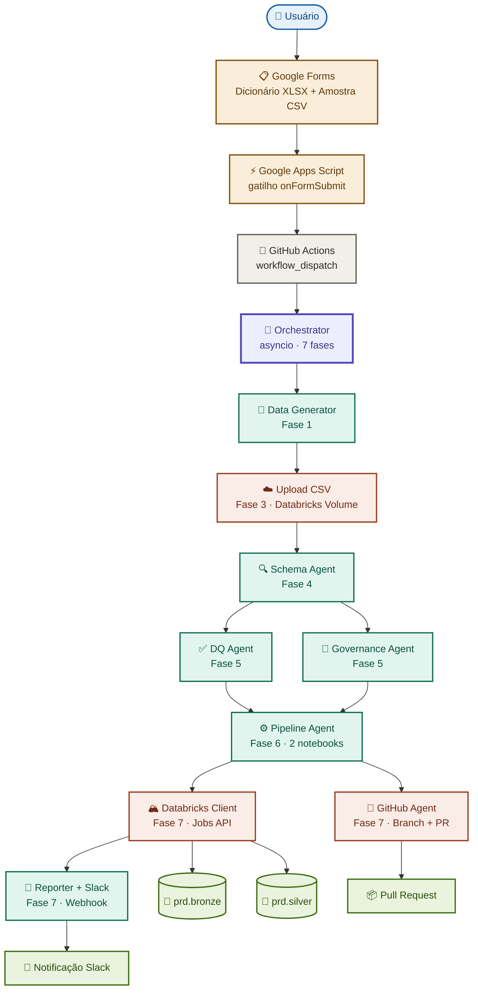
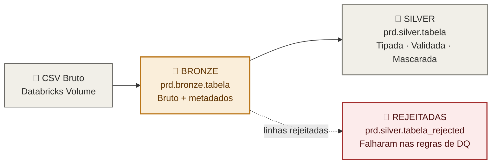

<div align="center">

# 🤖 Data Squad

### O Autonomous Data Engineer

**Um sistema multi-agente que constrói pipelines de dados de nível produção de ponta a ponta — sem nenhuma intervenção humana.**

[](https://github.com/sampaiooheitor/data-squad-ia/actions/workflows/data_squad.yml)
[](https://www.python.org/)
[](https://www.anthropic.com/)
[](https://www.databricks.com/)
[](LICENSE)

</div>

---

## 🎯 O que é o Data Squad?

O **Data Squad** é um sistema autônomo e multi-agente de engenharia de dados, movido pela **Claude API da Anthropic**. O usuário preenche um único Google Forms com um dicionário de dados (XLSX) e uma amostra de dados real (CSV) — e a partir desse momento, **seis agentes de IA especializados assumem o pipeline inteiro**: inferência de schema, regras de qualidade, governança de PII, geração de notebooks PySpark, execução no Databricks e notificação no Slack.

Nenhum engenheiro escreve uma linha de código. Ninguém clica em "executar". Do envio do formulário até as **Delta Tables Bronze + Silver em produção**, um pipeline completo no padrão Medallion Architecture é construído, revisado via Pull Request, executado e reportado — **em minutos**.

> 💡 Pense nele como uma equipe inteira de engenharia de dados comprimida em um workflow de CI/CD.

---

## 🏗️ Arquitetura



---

## 🧠 Os Agentes

Seis agentes especializados, cada um responsável por uma etapa do pipeline. Todos movidos pela Claude API.

| # | Agente | Responsabilidade | Modelo |
|---|--------|------------------|--------|
| 1️⃣ | **Data Generator** | Parseia o dicionário XLSX em um `DataDictOutput` tipado. Usa a amostra CSV real, ou gera dados sintéticos seguindo o schema exato. | `claude-opus-4` |
| 2️⃣ | **Schema Agent** | Infere tipos de dados, nullability e chaves primárias a partir dos dados + dicionário. | `claude-sonnet-4` |
| 3️⃣ | **DQ Agent** | Gera regras de data quality — `NOT NULL`, checagens de range, padrões regex — com severidades `error` / `warning`. | `claude-sonnet-4` |
| 4️⃣ | **Governance Agent** | Classifica colunas como PII e define a estratégia de mascaramento: `hash`, `mask` ou `encrypt`. | `claude-sonnet-4` |
| 5️⃣ | **Pipeline Agent** | Gera dois notebooks PySpark de produção: `bronze_ingest.py` e `silver_transform.py`. | `claude-opus-4` |
| 6️⃣ | **Reporter Agent** | Compõe um resumo legível do run e envia para o Slack. | `claude-haiku-4` |

> Os agentes DQ e Governance rodam **em paralelo** (Fase 5), assim como os agentes GitHub e Databricks/Slack (Fase 7) — orquestrados com `asyncio`.

---

## 🛠️ Tech Stack

<div align="center">

| Camada | Tecnologia |
|--------|-----------|
| 🤖 **IA / Agentes** |  |
| 🐍 **Orquestração** |   |
| 📋 **Entrada & Gatilho** |   |
| 🔧 **CI/CD** |  |
| 🏔️ **Lakehouse** |    |
| 🔔 **Notificação** |  |
| ✅ **Contratos** |  |

</div>

---

## ⚙️ Como Funciona

1. **📋 Envio** — O usuário preenche um Google Forms: faz upload de um dicionário de dados XLSX e uma amostra de dados CSV.
2. **⚡ Gatilho** — O Apps Script dispara no `onFormSubmit`, lê o XLSX via Drive API (converte para uma Google Sheet temporária, extrai o conteúdo pipe-separated, deleta a cópia), pega o CSV, extrai o nome da tabela e dispara o GitHub Actions.
3. **🔧 CI/CD** — O workflow `data_squad.yml` roda via `workflow_dispatch`, instala as dependências Python 3.12 e executa `python -m src.orchestrator`.
4. **🧬 Geração** — O Data Generator parseia o dicionário e prepara o dataset.
5. **☁️ Landing** — O CSV é enviado para um Databricks Volume em `/Volumes/prd/bronze/landing/<TABELA>/raw.csv`.
6. **🔍 Inferência** — O Schema Agent deriva tipos, nullability e chaves primárias.
7. **✅🔐 Validação & Governança** — Em paralelo, o DQ Agent escreve regras de data quality e o Governance Agent identifica PII + estratégias de mascaramento.
8. **⚙️ Construção** — O Pipeline Agent gera `bronze_ingest.py` e `silver_transform.py`.
9. **🔀🏔️ Envio & Execução** — Em paralelo: o GitHub Agent abre um PR com os notebooks; o Databricks Client importa e executa Bronze → Silver via Jobs API.
10. **💬 Relatório** — O Reporter Agent publica o resumo completo do run no Slack.

---

## 📤 Exemplo de Saída

Todo run produz **Delta Tables**, um **Pull Request** e uma **notificação no Slack**.

**Mensagem no Slack:**

```
🤖 Data Squad — Run Concluído ✅

📊 Tabela:        customers
📈 Linhas:        12.480 processadas → 12.341 limpas · 139 rejeitadas
🥉 Bronze:        prd.bronze.customers
🥈 Silver:        prd.silver.customers
🚫 Rejeitadas:    prd.silver.customers_rejected
🔀 Pull Request:  github.com/sampaiooheitor/data-squad-ia/pull/42
⏱️  Tempo total:   3m 18s
```

**Delta Tables geradas:**

```
prd.bronze.customers              ← ingestão bruta + metadados
prd.silver.customers              ← tipada, validada, PII mascarada
prd.silver.customers_rejected     ← linhas que falharam nas regras de DQ
```

---

## 🥉🥈 Medallion Architecture

O Data Squad segue o **Medallion Architecture pattern** — refinando os dados progressivamente através de camadas.



| Camada | Tabela | Transformações |
|--------|--------|----------------|
| 🥉 **Bronze** | `prd.bronze.<tabela>` | Ingestão bruta + metadados (`_ingested_at`, `_source_file`, `_source_system`) |
| 🥈 **Silver** | `prd.silver.<tabela>` | Casting de tipos, validação de data quality, mascaramento de PII |
| 🚫 **Rejected** | `prd.silver.<tabela>_rejected` | Linhas que falharam nas regras de data quality de severidade `error` |

---

## 🚀 Setup

### Secrets necessários no GitHub

Adicione em **Settings → Secrets and variables → Actions**:

| Secret | Descrição |
|--------|-----------|
| `ANTHROPIC_API_KEY` | Chave da Claude API para todos os agentes |
| `DATABRICKS_HOST` | URL do workspace Databricks |
| `DATABRICKS_TOKEN` | Token de acesso pessoal do Databricks |
| `SLACK_WEBHOOK_URL` | Webhook de entrada para notificações de run |
| `GH_PAT` | GitHub PAT com escopo `repo` (criação de branch + PR) |

### Google Apps Script

1. Abra o Google Forms → **Editor de Script**.
2. Cole o script de gatilho `onFormSubmit`.
3. Habilite o serviço avançado **Drive API**.
4. Adicione uma propriedade de script `GITHUB_PAT` para autorizar a chamada `workflow_dispatch`.
5. Configure o gatilho instalável: **Ao enviar formulário**.

### Rodar Localmente

```bash
git clone https://github.com/sampaiooheitor/data-squad-ia.git
cd data-squad-ia
pip install -r requirements.txt

export ANTHROPIC_API_KEY="sk-ant-..."
export DATABRICKS_HOST="https://..."
export DATABRICKS_TOKEN="dapi..."
export SLACK_WEBHOOK_URL="https://hooks.slack.com/..."

python -m src.orchestrator
```

---

<div align="center">

### Construído com 🤖 Claude API pela Anthropic

*Data Squad — onde o pipeline se constrói sozinho.*

⭐ Dê uma estrela neste repo se um engenheiro de dados autônomo parece o tipo de colega de equipe que você quer.

</div>
